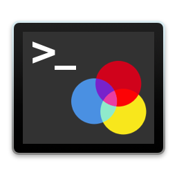
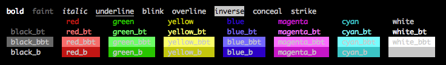
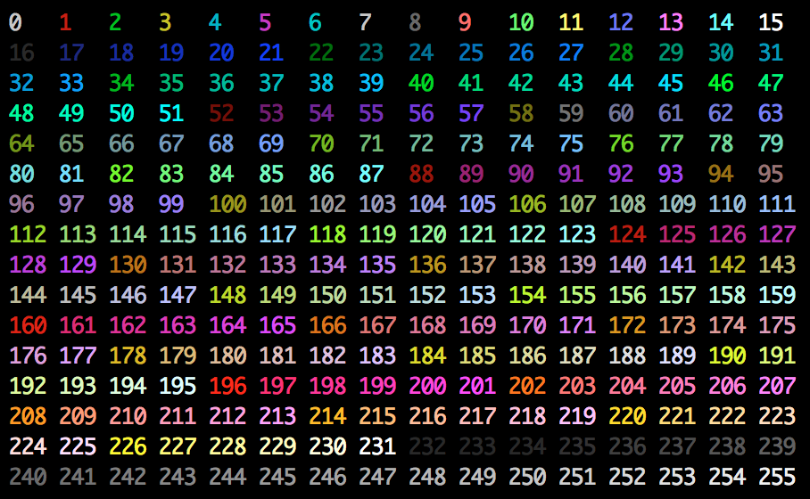

<div markdown="1">
  <sup>Using <a href="https://wangchujiang.com/#/app" target="_blank">my app</a> is also a way to <a href="https://wangchujiang.com/#/sponsor" target="_blank">support</a> me:</sup>
  <br>
  <a target="_blank" href="https://jaywcjlove.github.io/maslink/?id=6758053530" title="Scap: Screenshot & Markup Edit for macOS"></a>
  <a target="_blank" href="https://jaywcjlove.github.io/maslink/?id=6757317079" title="Screen Test for macOS"></a>
  <a target="_blank" href="https://jaywcjlove.github.io/maslink/?id=6755948110" title="Deskmark for macOS"></a>
  <a target="_blank" href="https://jaywcjlove.github.io/maslink/?id=6500434773" title="Keyzer for macOS"></a>
  <a target="_blank" href="https://github.com/jaywcjlove/vidwall-hub" title="Vidwall Hub for macOS"></a>
  <a target="_blank" href="https://jaywcjlove.github.io/maslink/?id=6752624705" title="VidCrop for macOS"></a>
  <a target="_blank" href="https://jaywcjlove.github.io/maslink/?id=6747587746" title="Vidwall for macOS"></a>
  <a target="_blank" href="https://wangchujiang.com/mousio-hint/" title="Mousio Hint for macOS"></a>
  <a target="_blank" href="https://jaywcjlove.github.io/maslink/?id=6746747327" title="Mousio for macOS"></a>
  <a target="_blank" href="https://jaywcjlove.github.io/maslink/?id=6745227444" title="Musicer for macOS"></a>
  <a target="_blank" href="https://jaywcjlove.github.io/maslink/?id=6743841447" title="Audioer for macOS"></a>
  <a target="_blank" href="https://jaywcjlove.github.io/maslink/?id=6744690194" title="FileSentinel for macOS"></a>
  <a target="_blank" href="https://jaywcjlove.github.io/maslink/?id=6743495172" title="FocusCursor for macOS"></a>
  <a target="_blank" href="https://jaywcjlove.github.io/maslink/?id=6742680573" title="Videoer for macOS"></a>
  <a target="_blank" href="https://jaywcjlove.github.io/maslink/?id=6740425504" title="KeyClicker for macOS"></a>
  <a target="_blank" href="https://jaywcjlove.github.io/maslink/?id=6739052447" title="DayBar for macOS"></a>
  <a target="_blank" href="https://jaywcjlove.github.io/maslink/?id=6739444407" title="Iconed for macOS"></a>
  <a target="_blank" href="https://jaywcjlove.github.io/maslink/?id=6737160756" title="Menuist for macOS"></a>
  <a target="_blank" href="https://jaywcjlove.github.io/maslink/?id=6723903021" title="Paste Quick for macOS"></a>
  <a target="_blank" href="https://jaywcjlove.github.io/maslink/?id=6670696072&platform=mac" title="Quick RSS for macOS/iOS"></a>
  <a target="_blank" href="https://jaywcjlove.github.io/maslink/?id=6670167443" title="Web Serve for macOS"></a>
  <a target="_blank" href="https://jaywcjlove.github.io/maslink/?id=6503953628&platform=mac" title="Copybook Generator for macOS/iOS"></a>
  <a target="_blank" href="https://jaywcjlove.github.io/maslink/?id=6471227008&platform=mac" title="DevTutor for macOS/iOS"></a>
  <a target="_blank" href="https://jaywcjlove.github.io/maslink/?id=6479819388&platform=mac" title="RegexMate for macOS/iOS"></a>
  <a target="_blank" href="https://jaywcjlove.github.io/maslink/?id=6479194014&platform=mac" title="Time Passage for macOS/iOS"></a>
  <a target="_blank" href="https://jaywcjlove.github.io/maslink/?id=6478772538" title="IconizeFolder for macOS"></a>
  <a target="_blank" href="https://jaywcjlove.github.io/maslink/?id=6478511402&platform=mac" title="Textsound Saver for macOS/iOS"></a>
  <a target="_blank" href="https://jaywcjlove.github.io/maslink/?id=6476924627" title="Create Custom Symbols for macOS"></a>
  <a target="_blank" href="https://jaywcjlove.github.io/maslink/?id=6476452351" title="DevHub for macOS"></a>
  <a target="_blank" href="https://jaywcjlove.github.io/maslink/?id=6476400184" title="Resume Revise for macOS"></a>
  <a target="_blank" href="https://jaywcjlove.github.io/maslink/?id=6472593276" title="Palette Genius for macOS"></a>
  <a target="_blank" href="https://jaywcjlove.github.io/maslink/?id=6470879005" title="Symbol Scribe for macOS"></a>
</div>
<hr>




# colors-cli

[](https://jaywcjlove.github.io/#/sponsor)
[](https://www.npmjs.com/package/colors-cli)
[](https://github.com/jaywcjlove/colors-cli/actions/workflows/ci.yml)
[](https://www.npmjs.com/package/colors-cli)


Terminal string styling done right.  ಠ_ಠ 



Install with npm:

```bash
npm install colors-cli --save-dev
```

# Styles

`bold`、 `faint`、 `italic`、 `underline`、 `blink`、 `overline`、 `inverse`、 `conceal`、 `strike`、

# Colors

<table>
  <thead><th>Foreground</th><th>Background</th><th></th><th>Bright Foreground</th><th>Bright Background</th><th></th></thead>
  <tbody>
    <tr>
      <td>black</td>
      <td>black_b</td>
      <td></td>
      <td>black_bt</td>
      <td>black_bbt</td>
      <td></td>
    </tr>
    <tr>
      <td>red</td>
      <td>red_b</td>
      <td></td>
      <td>red_bt</td>
      <td>red_bbt</td>
      <td></td>
    </tr>
    <tr>
      <td>green</td>
      <td>green_b</td>
      <td></td>
      <td>green_bt</td>
      <td>green_bbt</td>
      <td></td>
    </tr>
    <tr>
      <td>yellow</td>
      <td>yellow_b</td>
      <td></td>
      <td>yellow_bt</td>
      <td>yellow_bbt</td>
      <td></td>
    </tr>
    <tr>
      <td>blue</td>
      <td>blue_b</td>
      <td></td>
      <td>blue_bt</td>
      <td>blue_bbt</td>
      <td></td>
    </tr>
    <tr>
      <td>magenta</td>
      <td>magenta_b</td>
      <td></td>
      <td>magenta_bt</td>
      <td>magenta_bbt</td>
      <td></td>
    </tr>
    <tr>
      <td>cyan</td>
      <td>cyan_b</td>
      <td></td>
      <td>cyan_bt</td>
      <td>cyan_bbt</td>
      <td></td>
    </tr>
    <tr>
      <td>white</td>
      <td>white_b</td>
      <td></td>
      <td>white_bt</td>
      <td>white_bbt</td>
      <td></td>
    </tr>
  </tbody>
</table>

## Basic usage:

Output colored text:

```js
var color = require('colors-cli')
console.log( color.red('hello') )
```

Best way is to predefine needed stylings and then use it:

```js
var color = require('colors-cli/safe')
var error = color.red.bold;
var warn = color.yellow;
var notice = color.blue;
console.log(error('Error!'));
console.log(warn('Warning'));
console.log(notice('Notice'));
```

Styles can be mixed:

```js
var color = require('colors-cli/safe')
console.log('=>', color.red.bold.underline('hello') )
console.log('=>', color.magenta_bt.underline('hello ' + color.blue_bt('wo' + color.yellow_bt.magenta_bbt('r') + 'ld') + ' !!!!'));
console.log('=>', color.magenta_bt.underline('hello ' + color.blue_bt('wo' + color.yellow_bt.magenta_bbt('r'))));
console.log('=>', color.magenta_bt.underline('hello ' + color.blue_bt('world') + ' !!!!' + color.yellow('kenny') + ' wong' ));

var color = require('colors-cli/safe')
require('colors-cli/toxic')
console.log('=> ' + color.underline('$ ' + 'npm'.magenta.underline + ' install'.yellow.underline + ' colors-cli --save-dev'));
```


```js
require('colors-cli/toxic')
console.log( 'hello'.green );
console.log( 'hello'.green.black_b.underline );
console.log('=> $'.green + ' npm '.magenta + 'install '.yellow + 'colors-cli'.cyan + ' --save-dev');
```

# ANSI 256 colors

Support ANSI 256 colors. [0 - 255], The rules of method name. 

 - Foreground `x32` 
 - Background `xb32`

```js
var color = require('colors-cli/safe')
console.log( color.x45.bold.underline('hello') )

require('colors-cli/toxic')
console.log( 'hello'.x23.underline );
console.log( 'hello'.green.xb34.underline );
```



### Use the command line

```bash
 Usage: colors

 Options:

   --black  => black
   --black_b  => black_b
   --red  => red
   ...

 Examples:

   colors --red "\nhello world" --bold,underline,yellow "wcj"
   colors --green,bold "\nhello world"
   colors --x12,bold "hello world"
```


# Reference

- [The opaque named colors](https://drafts.csswg.org/css-color/#named-colors)
- [ANSI escape code](https://en.wikipedia.org/wiki/ANSI_escape_code)


The [ANSI Escape](https://en.wikipedia.org/wiki/ANSI_escape_code) sequences control code screen.

```bash
echo -e "\033[31;41;4m something here 33[0m"
```

`\033` As the escape character, inform the terminal to switch to the escape mode.  
`[` The beginning of the CSI.  
`m` Make the action to be performed.  
`;` ASCII code separator.  

# License

Licensed under the MIT License.
